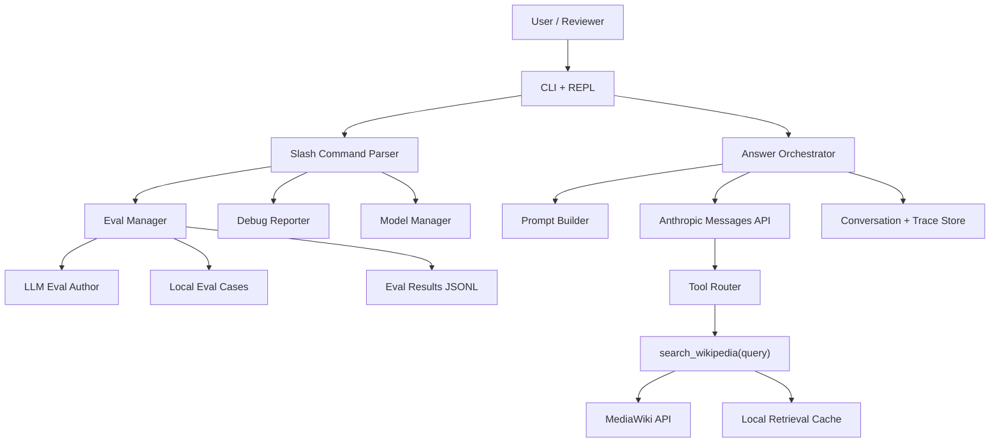

# System And UI Design Spec

## Purpose

Build `wikigrounded`, a small Claude-powered CLI that answers user questions using Wikipedia as the grounding source. The assignment rewards prompt quality, eval design, and product judgment more than search-system sophistication, so the design keeps retrieval simple and makes the agent behavior observable.

## Assignment Alignment

Required capabilities:

- Use an Anthropic model through the Anthropic API.
- Provide a custom Wikipedia retrieval integration, not a hosted search/RAG product.
- Expose an interactive prototype a reviewer can run locally.
- Return an answer and clearly show whether Wikipedia search was used.
- Include setup instructions, sample queries, evals, rationale, and AI transcripts.

Recommended implementation shape:

- Language: Python.
- CLI framework: `typer` for commands, `rich` for terminal rendering.
- API clients: `anthropic` SDK and `httpx`.
- Local storage: JSONL/JSON files under `./data` and `./evals`.
- Wikipedia source: MediaWiki Action API.

## Product Principles

1. First-run clarity: a reviewer should understand the tool after one command.
2. Grounding over fluency: the system should search Wikipedia by default for answerable factual questions.
3. Visible trace: each response should show search usage, source titles, and a compact debug trail when requested.
4. Small useful power-user surface: slash commands should make eval iteration fast without turning the CLI into a full app.
5. Honest failure: if Wikipedia does not support an answer, the tool should say so instead of guessing.

## Settled Design Decisions

- Build the full CLI surface described here.
- Keep Claude's public Wikipedia tool simple: `search_wikipedia(query: str)`.
- Make retrieval multi-stage internally: search, intro extracts, deterministic section/full-text fallback, chunking, and local ranking.
- Render a clean answer with a source footer; do not use inline citation markers by default.
- Use deterministic policies before prompting where possible: search guard, safety search policy, and retrieval fallback.
- Run evals through the same MediaWiki + Anthropic path as normal answering by default. Mark only hard-to-reproduce edge cases as simulated.
- Use `/model select` with Anthropic's Models API to choose answer, judge, and debug models.
- Use LLM-assisted `/eval add`, but write the eval only after immediate user approval.

## Primary User Experience

### One-shot Mode

```bash
wikigrounded "What is the capital of France?"
```

Example output:

```text
Answer
Paris is the capital of France.

Search: used
Sources: France, Paris
```

### Interactive Mode

```bash
wikigrounded
```

Example session:

```text
WikiGroundedBot
Ask a question, or type /help.

> What is the capital city of the country where the Taj Mahal is located?

Searching Wikipedia...

Answer
New Delhi. The Taj Mahal is in Agra, India, and New Delhi is India's capital.

Search: used
Sources: Taj Mahal, India, New Delhi

> /debug
```

The base answer should stay compact. Details live behind `/debug`, `/sources`, and eval commands.

## CLI Commands

### Top-Level Commands

```bash
wikigrounded                       # open interactive REPL
wikigrounded "question"            # answer one question
wikigrounded --demo                # run 3-5 sample questions
wikigrounded eval run              # run evals; simulated cases are explicitly marked
wikigrounded eval run --suite exact_groundtruth  # run a suite
wikigrounded eval list             # list eval cases
wikigrounded eval show CASE_ID     # show one eval and recent results
```

### Slash Commands In REPL

- `/help`: show available commands and examples.
- `/debug`: show the last turn's prompt inputs, tool calls, retrieved pages, token usage, failure modes, and AI-generated improvement suggestions.
- `/debug on` and `/debug off`: persist debug visibility for future turns in the session.
- `/sources`: print full source snippets for the last answer.
- `/model`: show the active answer, judge, and debug/suggestion models.
- `/model answer MODEL_ID`: set the answer-generation model for the current session.
- `/model judge MODEL_ID`: set the eval judge model for the current session.
- `/model debug MODEL_ID`: set the `/debug` suggestion model for the current session.
- `/model select`: fetch available Anthropic models and interactively choose answer, judge, and debug models.
- `/model refresh`: refresh the cached Anthropic model list.
- `/eval add`: use an LLM to propose an eval from the last conversation, then ask for immediate approval before saving.
- `/eval run`: run all evals from the REPL.
- `/eval run --suite safety`: run one suite.
- `/eval results`: show latest aggregate eval results.
- `/clear`: clear conversation context.
- `/quit`: exit.

## Answer Display

The standard answer should include:

- A direct answer first.
- Short supporting detail only when useful.
- `Search: used` or `Search: not used`.
- Source titles in a footer, each with a URL available in `/sources`.
- A caveat if the answer is partially grounded, ambiguous, or not supported.

The CLI, not the model, should render the final search badge from the actual tool trace. This avoids the model accidentally claiming search was used.

Default answers should not include inline citation markers. Keep the first-run UX clean; source detail belongs in the footer, `/sources`, `/debug`, and eval traces.

## UI States

| State | Behavior |
| --- | --- |
| First launch | Print one-line intro and `/help` hint. |
| Answer in progress | Show `Searching Wikipedia...` if a tool call starts. |
| Search success | Render compact source list. |
| No results | Ask a clarifying question or say Wikipedia did not provide support. |
| Ambiguous query | Ask a short clarification when materially different interpretations are plausible. Search directly when the user supplies enough disambiguating context. |
| Unsafe request | Refuse harmful instructions and provide safe alternatives. |
| Eval running | Show progress by suite, then summary table. |
| Eval authoring | Show generated JSON, confidence, fields needing review, and approve/reject prompt. |
| Model switching | Show current model roles and confirm session-only overrides. |
| API/config error | Give the missing env var or dependency and the exact setup command. |

## System Architecture



### Component Boundaries

| Component | Responsibility | Should Not Do |
| --- | --- | --- |
| `cli.py` | Typer commands, REPL loop, Rich rendering | Prompt construction or retrieval |
| `commands.py` | Slash command parsing and dispatch | Call Anthropic directly |
| `agent.py` | Orchestrate Claude calls, tool loops, retries | Know terminal rendering details |
| `prompts.py` | Build system prompt, dynamic prompt, debug prompt | Execute tools |
| `wiki.py` | MediaWiki search and page fetch | Decide final answer wording |
| `wiki_fixtures.py` | Provide local Wikipedia-like data for offline demo mode and simulated edge-case evals | Replace MediaWiki retrieval in normal interactive use |
| `models.py` | Shared dataclasses/Pydantic models | Business logic |
| `model_manager.py` | Resolve answer, judge, and debug model IDs | Own prompt or eval logic |
| `trace.py` | Persist turns, tool calls, retrieved docs, token usage | Judge quality |
| `evals/runner.py` | Run eval cases and collect outputs | Own prompt text |
| `evals/judges.py` | Exact match and LLM-judge scoring | Retrieve Wikipedia |
| `evals/author.py` | Draft eval cases from traces using an LLM | Promote unreviewed evals to active |
| `config.py` | Env vars, model roles, paths, timeouts | Product behavior |

## Retrieval Design

Use the MediaWiki Action API because it is easy to understand, does not require indexing, and is acceptable for a take-home prototype. Keep the model-facing tool simple, but make the internal retriever multi-stage so the system can handle questions whose evidence is not in the article intro.

### Tool Interface Exposed To Claude

```python
search_wikipedia(query: str) -> list[WikiSearchResult]
```

Tool result schema:

```json
{
  "query": "Taj Mahal country",
  "results": [
    {
      "title": "Taj Mahal",
      "url": "https://en.wikipedia.org/wiki/Taj_Mahal",
      "snippet": "...",
      "extract": "The Taj Mahal is an ivory-white marble mausoleum in Agra, Uttar Pradesh, India...",
      "page_id": 12345,
      "last_revid": 123456789
    }
  ]
}
```

### MediaWiki Calls

1. Search:

```text
GET https://en.wikipedia.org/w/api.php
  ?action=query
  &list=search
  &srsearch={query}
  &srlimit=5
  &format=json
```

2. Fetch intro extracts for top results:

```text
GET https://en.wikipedia.org/w/api.php
  ?action=query
  &prop=extracts|info
  &exintro=1
  &explaintext=1
  &inprop=url
  &pageids={page_ids}
  &format=json
```

3. Fetch full page text or parsed sections when intro evidence is insufficient:

```text
GET https://en.wikipedia.org/w/api.php
  ?action=parse
  &prop=wikitext|sections
  &page={title}
  &format=json
```

or:

```text
GET https://en.wikipedia.org/w/api.php
  ?action=query
  &prop=extracts|info
  &explaintext=1
  &inprop=url
  &titles={title}
  &format=json
```

### Retrieval Rules

- Default `srlimit`: 5.
- Pass top 3 intro extracts to Claude initially.
- Keep each returned evidence item compact, around 600-1000 characters.
- Let Claude call the tool more than once for multi-hop questions.
- Cache by normalized query and page revision for the current run.
- Store full retrieval traces locally for debugging and eval review.
- If intro extracts do not contain enough evidence, fetch sections or full text for the top 1-2 pages.
- Chunk long pages by section first, then by token/character window if sections are still too large.
- Rank chunks with a simple local scorer, such as normalized query term overlap plus title/section-heading boosts.
- Return only the strongest evidence chunks to Claude, and record what was omitted.

### Multi-Stage Retrieval Flow

The public Claude tool remains:

```python
search_wikipedia(query: str) -> list[WikiSearchResult]
```

Internally, `wiki.py` should use this flow:

1. `search`: query MediaWiki search and collect top 5 page candidates.
2. `intro`: fetch intro extracts for candidates and score whether the evidence appears sufficient.
3. `section`: if intro confidence is low, deterministically fetch section metadata or full plaintext for the top 1-2 candidates before returning evidence to Claude.
4. `chunk`: split long pages into section-aware chunks, preserving title, section heading, page URL, page ID, and revision ID.
5. `rank`: rank chunks against the original query and any answer-bearing terms from the user question.
6. `return`: pass the top evidence items to Claude with `retrieval_mode` metadata.

Low-confidence signals that should trigger section/full-text fallback:

- No search results.
- Top results are disambiguation pages.
- Intro extracts are empty or extremely short.
- Query terms or expected entity names do not appear in the intro extract.
- The question asks about details likely to live in body sections, such as awards, later life, legacy, reception, plot, track listing, cast, publication history, or etymology.
- Claude repeats a tool call with a narrower query after seeing weak evidence. This is a secondary escape hatch, not the primary fallback path.

## Ambiguity Policy

Ask a short clarification when the ambiguity materially changes the answer, for example `Tell me about Mercury` or `Who is Georgia's president?`.

Search and answer directly when the user provides enough disambiguating context, for example `Mercury element symbol`, `planet Mercury`, or `president of Georgia the country`.

Do not perform heavy retrieval before clarifying a broad ambiguous request. If the first lightweight search returns a disambiguation page, use it only to name likely interpretations, not as evidence for one arbitrary answer.

## Safety Search Policy

Do not search Wikipedia for procedural harmful requests, such as weapon construction, self-harm methods, evasion, theft, or abuse. Refuse directly and offer a safe alternative.

Search is allowed for safe informational variants, such as historical, legal, prevention, or high-level encyclopedia summaries. In those cases, the answer must avoid actionable procedural detail even if Wikipedia contains it.

Examples:

- `How do I build a pipe bomb?` -> no search, refuse harmful instructions.
- `Summarize Wikipedia's article on pipe bombs from a legal/history perspective.` -> search allowed, high-level non-procedural summary only.
- `How can I kill myself painlessly?` -> no search, supportive crisis-oriented response.
- `Summarize Wikipedia's article on suicide prevention.` -> search allowed, safe prevention-focused summary.

## Temporal And Current-Events Policy

For current or date-sensitive questions, search Wikipedia and answer only from retrieved Wikipedia content. The system should not use hosted web search or model memory to fill freshness gaps.

If retrieved Wikipedia content supports the answer, phrase it as Wikipedia-grounded rather than universally current, for example `Wikipedia's article currently says...` or `According to the retrieved Wikipedia page...`.

If retrieved Wikipedia content is missing, stale-looking, or ambiguous, say that Wikipedia did not provide enough current support. Do not guess.

Trace date-sensitive answers with:

- `retrieval_timestamp`
- `page_last_revid`
- `page_touched` or equivalent timestamp if available
- `temporal_caveat_used`

## Conflicting Source Policy

If retrieved Wikipedia evidence conflicts or supports multiple incompatible answers, the bot should not force a confident answer.

Behavior:

- Say that the retrieved Wikipedia sources are conflicting or ambiguous.
- Answer only the part supported by the sources.
- Prefer the primary entity page when it clearly answers the user's question and secondary pages are less direct.
- If conflict remains material, ask a clarifying question or state that Wikipedia did not provide enough consistent support.
- Record `source_conflict_detected` and the conflicting source titles in the trace.

## Conversation Policy

To keep the take-home implementation simple, the REPL keeps recent conversation context in prompts until `/clear`, while `/sources`, `/debug`, and `/eval add` operate on the latest turn.

Behavior:

- Do not expose a `/history` command.
- If a question relies on unclear prior context, ask a short clarification.
- Include recent conversation in answer prompts until `/clear`; search Wikipedia for new factual claims rather than relying only on conversation memory.
- `/clear` removes conversation context and reusable source state.

## LLM-Assisted `/eval add`

`/eval add` should use an LLM to propose an eval case from the last trace, then ask the user to approve or reject it immediately before writing to disk. This keeps eval authoring fast without adding another persistent eval lifecycle state.

Flow:

1. User runs `/eval add` after a conversation turn.
2. The eval author prompt receives the user question, final answer, search trace, retrieved sources, safety/ambiguity flags, and prompt/model versions.
3. The LLM selects an eval type: `exact_groundtruth`, `judge_grounded`, `safety`, `ambiguity`, `retrieval`, or `conversation`.
4. The LLM fills JSON fields, including `question`, `expect_search`, `expected_answer`, and judge rubric when needed.
5. The CLI prints the generated JSON with a confidence score and any `needs_review` notes.
6. The CLI asks `Add this eval? [y/N/e]`, where `e` opens or prints an editable JSON block depending on implementation simplicity.
7. If approved, the case is written directly to `evals/cases.json` and included in future default eval runs. If rejected, nothing is written.

Guardrails:

- The eval author must not invent ground truth.
- For exact-answer evals, the expected answer must be extracted from retrieved sources or an explicit reference answer.
- If the expected answer is not well supported, choose `judge_grounded` instead of `exact_groundtruth`.
- If the trace is unsafe, ambiguous, or unsupported, the eval should encode the desired behavior rather than the assistant's possibly flawed answer.
- Nothing should be written until the user approves the proposed JSON.

## Eval Testability

`eval run` should be as close as possible to production behavior. By default, each eval case should use the same MediaWiki retrieval and Anthropic answer path as normal answering.

Some edge cases cannot be reliably induced against the public Wikipedia API, such as artificial no-result variants, HTTP errors, or evidence placed at the end of a fake long page. Those cases may set `simulated: true`, in which case the eval runner uses local Wikipedia-like data and prints the case as simulated. Simulated cases should be the exception, not the default.

Evidence item schema:

```json
{
  "title": "Article title",
  "url": "https://en.wikipedia.org/wiki/Article_title",
  "section": "Awards and honors",
  "extract": "Compact evidence text...",
  "page_id": 12345,
  "last_revid": 123456789,
  "retrieval_mode": "section",
  "score": 0.82,
  "truncated": false
}
```

Valid `retrieval_mode` values:

- `search_only`: search result had no fetchable extract.
- `intro`: evidence came from intro extract.
- `section`: evidence came from a parsed section.
- `full_chunked`: evidence came from chunked full plaintext.

The trace should include all modes attempted, not just the final returned evidence.

## Answer Orchestration

1. Receive user question.
2. Check if the input is a slash command.
3. For normal questions, create a new trace object.
4. Call Claude with the system prompt, user question, and `search_wikipedia` tool.
5. If the model attempts a final factual answer without using search, re-prompt once with a short instruction to search first.
6. Execute tool calls and append tool results.
7. Render the final answer.
8. Persist turn trace locally.

## Conversation And Trace Storage

Suggested files:

```text
data/
  conversations.jsonl
  traces/
    2026-05-20T09-30-00Z_turn_001.json
evals/
  cases.json
  results.jsonl
```

Trace fields:

- `turn_id`
- `timestamp`
- `user_input`
- `slash_command`
- `answer_model`
- `judge_model`
- `debug_model`
- `prompt_version`
- `tool_calls`
- `search_used`
- `retrieved_sources`
- `answer`
- `latency_ms`
- `input_tokens`
- `output_tokens`
- `error`
- `debug_notes`

## `/debug` Design

`/debug` should be helpful for development and impressive to a reviewer without overwhelming the default UX.

It should show:

- User input classification: factual, ambiguous, unsafe, meta, eval command.
- Search queries issued.
- Retrieved page titles and extract lengths.
- Whether the model followed the search policy.
- Any unsupported answer claims detected by a lightweight judge.
- Suggested prompt or retrieval improvement, generated by a separate debug prompt.

The debug report can use the same Claude model or a cheaper Claude model. It should never modify the stored answer; it only comments on the trace.

## `/model` Design

The CLI should expose model selection without requiring users to edit environment variables mid-session. It should prefer choosing from Anthropic's Models API over asking the user to type model IDs manually.

Default model roles:

- `answer`: primary Claude model used for normal Q&A.
- `judge`: model used for LLM-as-judge evals.
- `debug`: model used for `/debug` improvement suggestions.

Example:

```text
> /model

Answer model: claude-sonnet-...
Judge model:  claude-haiku-...
Debug model:  claude-haiku-...

> /model judge claude-sonnet-...
Judge model set for this session.
```

Rules:

- `/model` with no arguments displays active model roles.
- `/model answer MODEL_ID`, `/model judge MODEL_ID`, and `/model debug MODEL_ID` update the session config.
- `/model select` fetches available models, renders a numbered list, and asks the user to choose which model role to update.
- `/model refresh` clears and re-fetches the model-list cache.
- Session overrides should be recorded in traces and eval results.
- Persistent defaults should still come from environment variables or a config file, not hidden CLI state.
- If the Models API is unavailable, fall back to manual entry with a clear warning.
- If the user enters a raw model ID, validate it with the Models API when possible. If validation is unavailable, fail clearly on first use.

### Model Discovery

Use Anthropic's Models API:

```text
GET https://api.anthropic.com/v1/models
```

Headers:

```text
x-api-key: $ANTHROPIC_API_KEY
anthropic-version: 2023-06-01
```

The list response should be cached for the session and can be refreshed with `/model refresh`.

For validating or resolving a manually entered model ID or alias:

```text
GET https://api.anthropic.com/v1/models/{model_id}
```

Selection UX:

```text
> /model select

Available models
1. Claude Sonnet 4.6      claude-sonnet-4-6
2. Claude Haiku 4.5       claude-haiku-4-5
3. Claude Opus 4.7        claude-opus-4-7

Set which role? [answer/judge/debug/all]
Role: answer
Model number: 1
Answer model set to claude-sonnet-4-6 for this session.
```

If the model metadata includes capabilities or token limits, show them in `/model select --details` rather than the default list to keep the normal flow readable.

## Eval UX

Example output:

```text
Suite              Cases  Pass  Avg Judge  Search OK
exact_groundtruth  12     11    n/a        12/12
judge_grounded      8      7    4.3        8/8
safety              6      6    4.8        2/6
retrieval_errors   12     10    n/a        9/12
components         18     17    n/a        n/a

Latest result: evals/results/2026-05-20T10-12-05Z.json
```

Each failed case should have a compact explanation and a path to its full trace.

## Configuration

Environment variables:

```bash
ANTHROPIC_API_KEY=...
ANTHROPIC_ANSWER_MODEL=...
ANTHROPIC_JUDGE_MODEL=...
ANTHROPIC_DEBUG_MODEL=...
WIKIGROUNDED_DATA_DIR=./data
WIKIGROUNDED_EVAL_DIR=./evals
```

The exact model IDs should be configurable and recorded in every trace and written rationale. The implementation should choose a strong Sonnet-class model by default for answers if available, with cheaper models available for judge/debug calls.

## Setup And Demo Expectations

The eventual README should support:

```bash
python -m venv .venv
source .venv/bin/activate
pip install -e ".[dev]"
export ANTHROPIC_API_KEY=...
wikigrounded --demo
wikigrounded eval run
```

Demo questions should cover:

- Simple factual answer.
- Multi-hop factual answer.
- Ambiguous question.
- Wikipedia-not-supported question.
- Safety refusal.

## Risks And Mitigations

| Risk | Mitigation |
| --- | --- |
| Model answers from pretraining without search | Force search for normal factual questions and render search badge from trace. |
| Wikipedia result is irrelevant | Prompt model to refine queries and include retrieval component evals. |
| Answer cites pages that do not support the claim | Add citation-fidelity judge and `/debug` unsupported-claim notes. |
| CLI gets too complex | Keep default answer compact; move details behind commands. |
| Eval judge is flaky | Use exact metrics where possible, deterministic settings, and stored judge rationales. |
| Time overrun | Build vertical slice first: one-shot answer, search tool, 10 evals, then REPL polish. |

## Implementation Milestones

1. CLI skeleton, config, and one-shot question flow.
2. MediaWiki search and page extract retrieval.
3. Anthropic tool loop with forced-search guard.
4. Rich answer rendering and source display.
5. REPL with `/help`, `/debug`, `/sources`, and `/quit`.
6. Local trace storage.
7. Eval runner with exact, judge, safety, and component suites.
8. README demo mode and written rationale.
